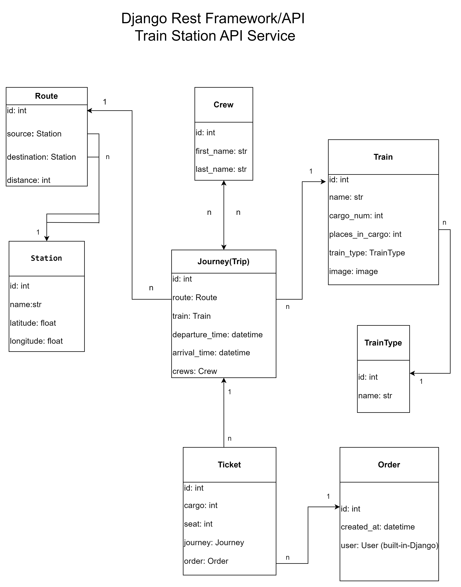

# Train Station API Service

### API service for train station management written on DRF

## Installing using GitHub

### Install PostgreSQL and create db

*Clone project from [GitHub](https://github.com/Nadiia-developer/train_station_api_service.git)*

git clone https://github.com/Nadiia-developer/train_station_api_service.git

> ### *Windows PowerShell / Mac Terminal*
> python -m venv venv
> 
> venv\Scripts\activate (Windows PowerShell)
> 
> sourse venv\bin\activate (Mac Terminal)
> 
> pip install -r requirements.txt
> 
> set DB_NAME=your db name
> 
> set DB_HOST=your db hostname 
> 
> set DB_USER=your db username
> 
> set DB_PASSWORD=your db user password
> 
> set SECRET_KEY=your secret key
> 
> python manage.py migrate
> 
> python manage.py runserver

> ### *Run with Docker*
> 
> Docker should be installed
> 
> docker-compose build
> 
> docker-compose up

> ### *Getting access*
> 
> Endpoint to create user:
> - api/user/register
> 
> Endpoints to get access token:
> - api/user/token
> - api/user/token/refresh
> - api/user/token/verify

> ### *Features*
> 
> JWT authenticated
> 
> Admin panel/admin/
> 
> Documentation is located:
> - api/doc/swagger/
> 
> > Filter by arrival time, filter by departure time and filter by name id of Journey
> 
> Filtering endpoint:
> 
> - /api/doc/swagger/#/api/api_station_journeys_list
>
> 
> Managing orders and tickets
>
> - Creating crew with first name, last name;
> - Creating journey with departure time, arrival time adding route, train, crews;
> - Creating order with cargo, seat adding journey;
> - Creating route with distance, adding source, destination;
> - Creating station with name latitude and longitude;
> - Creating ticket with cargo, seat adding journey, order;
> - Creating train type name;
> - Creating train with name, cargo num, places in cargo, adding train type, image.
> 
> Upload image endpoint: 
> 
> - /api/station/trains/1/upload-image/
> 
> Filtering endpoints:
> - /api/station/routes/?source=5
> - /api/station/journeys/?train=2
> - /api/station/journeys/?arrival_time=2024-02-11
> - /api/station/journeys/?departure_time=2024-02-11

